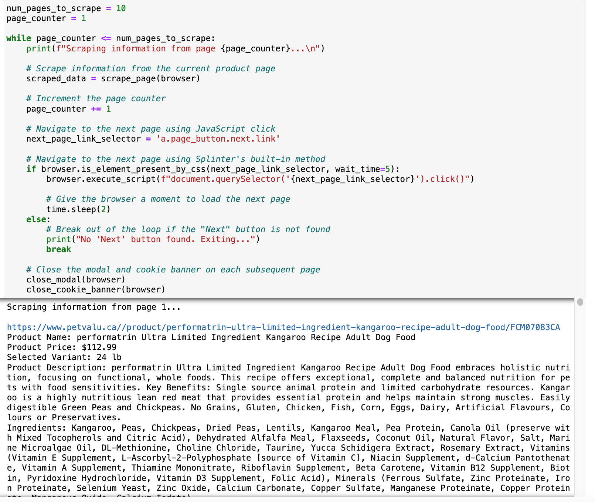
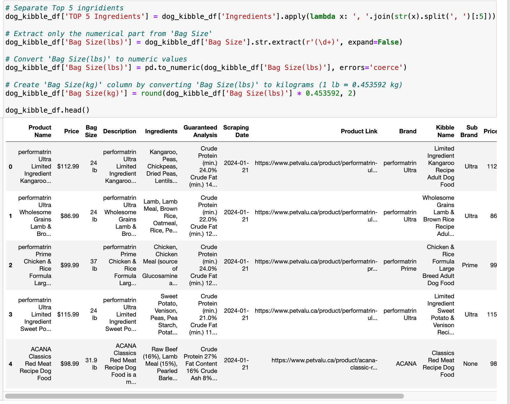
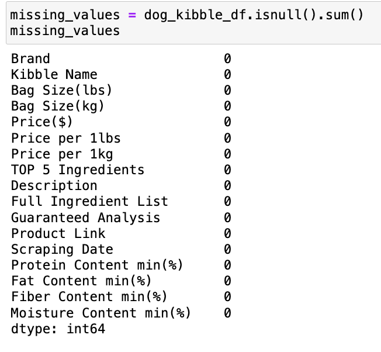
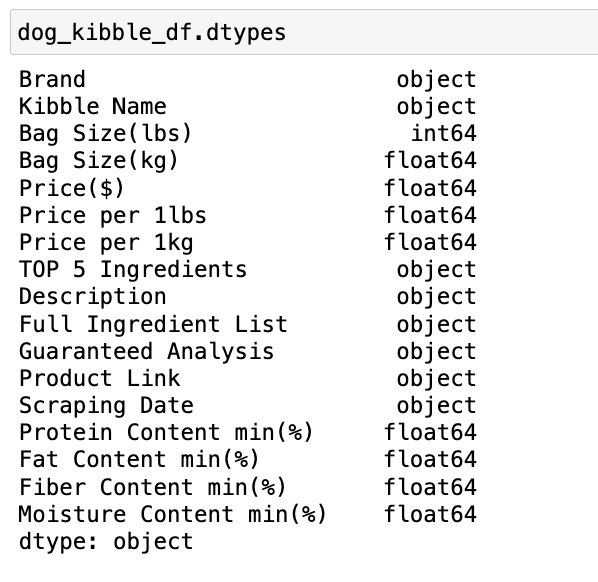
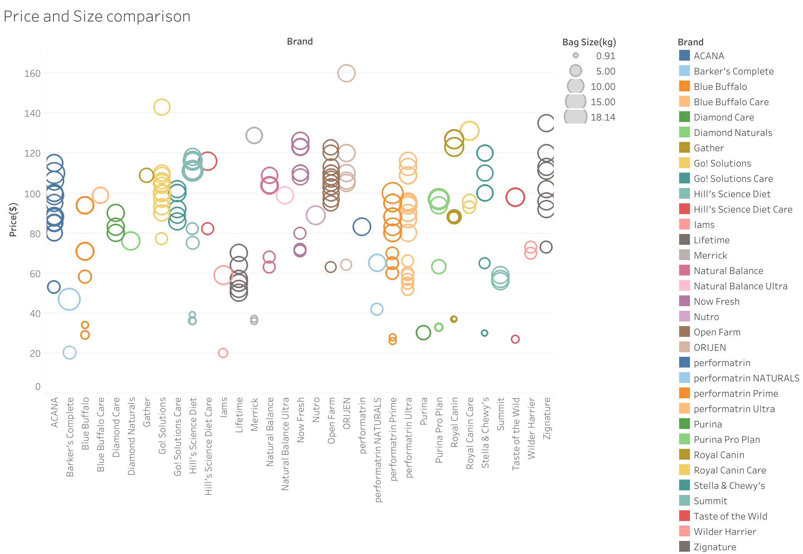
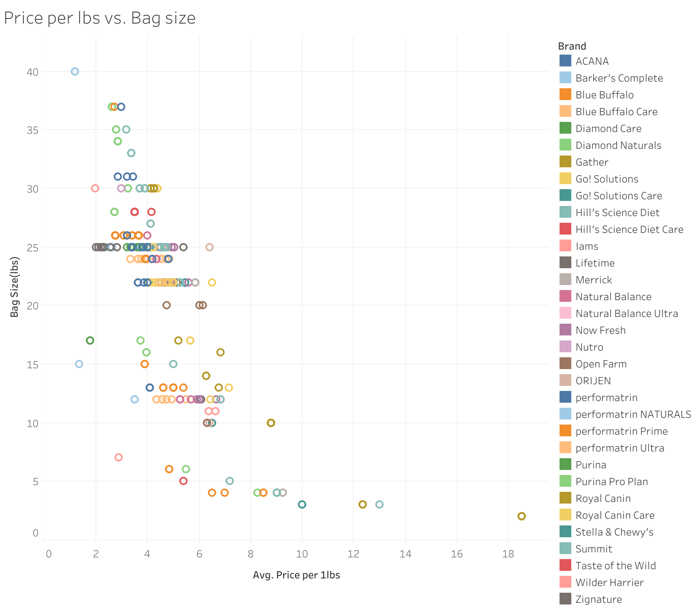
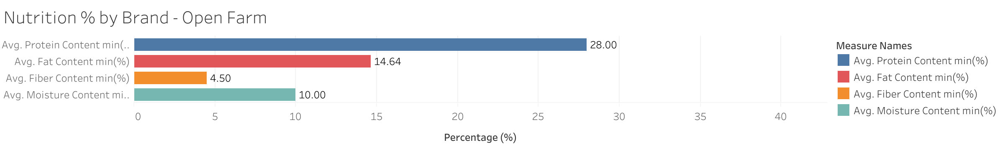
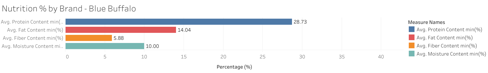
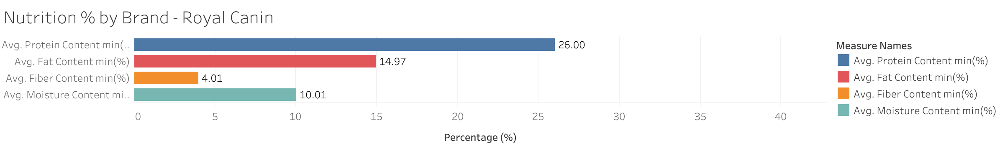
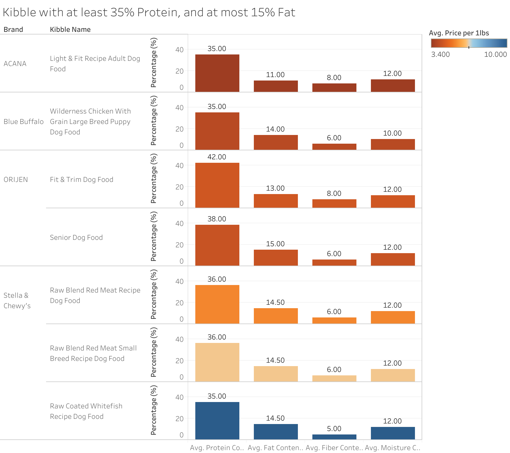

# Dog Kibble Data Analytics Project

## Table of Contents

- [About](#about)
- [Project Structure](#project-structure)
- [Data Collection and Cleaning](#data-collection-and-cleaning)
- [Data Analysis](#data-analysis)
- [Insights](#insights)
- [Dependencies](#dependencies)

## About

Explore the dog kibble through this data analytics project. I've gathered and analyzed information on various aspects, including pricing, bag sizes, and nutritional content. The project involves scraping data from a pet values website, cleaning it, and creating insightful visualizations using Tableau.

### Project Goals

1) Uncover patterns in pricing, bag sizes, and nutritional content to aid dog owners in making informed choices for their pets.
2) Visualize key aspects like price and size comparisons, nutritional content per brand, and more.
3) Provide a detailed analysis of specific nutritional criteria, such as kibbles with at least 35% protein and no more than 15% fat.

## Project Structure

- `Scraping/`: Contains Python scripts for scraping the data.
- `Cleaning/`: Contains Python scripts for cleaning the data.
- `Resources/`: Holds raw and cleaned datasets in CSV format.
- `Images/`: Includes images of visualizations created in Tableau.
- `Pet Value Dog Kibble.twbx`: Tableau file with all of the visualizations
- `README.md`: The main documentation file providing an overview of the project.

## Data Collection and Cleaning

- **Scraping:** Python scripts were employed to extract information on dog kibble, covering kibble name, ingredients, description, guaranteed analysis, bag size, and price.

- **Cleaning:** Pandas and Numpy were used to handle missing values, format prices, extract brand names, and create new columns for key information.

## Data Analysis

### Visualizations in Tableau

1. **Price and Size Comparison:**
   - Circle views illustrate the relationship between prices and bag sizes.

2. **Bag Size vs. Price per Pound:**
   - Circle views showcase how bag size correlates with price per pound.

3. **Nutritional Content per Brand:**
   - Bar chart visualizing protein, fat, fiber, and moisture content per brand.

4. **Filtered Nutritional Comparison:**
   - Bar chart highlighting kibbles meeting specific nutritional criteria.

## Insights

- Pricing and bag size comparisons reveal variations, aiding users in finding cost-effective options.
- Nutritional content per brand provides insights into the diversity of offerings in the market.
- Filtered nutritional comparison helps identify kibbles meeting specific protein and fat content criteria.

## Dependencies

- Python 3.x
- Pandas
- Numpy
- Tableau
